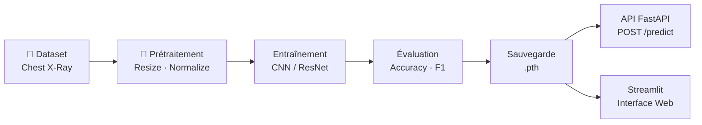

# Chest X-Ray Classification — Détection de Pneumonie par Deep Learning

> **Système de classification automatique de radiographies thoraciques** permettant de distinguer les cas **NORMAL** des cas de **PNEUMONIE** à l'aide de réseaux de neurones convolutifs (CNN) entraînés avec PyTorch.

---

## 📋 Table des Matières

- [ Contexte Médical](#-contexte-médical)
- [ Fonctionnalités](#-fonctionnalités)
- [ Architectures des Modèles](#-architectures-des-modèles)
- [ Dataset](#-dataset)
- [ Installation](#️-installation)
- [ Utilisation](#-utilisation)
- [ Structure du Projet](#-structure-du-projet)
- [ Technologies Utilisées](#️-technologies-utilisées)
- [ Auteur](#-auteur)

---

##  Contexte Médical

La **pneumonie** est une infection respiratoire aiguë qui affecte les poumons. Elle constitue l'une des principales causes de mortalité chez les enfants de moins de 5 ans dans le monde. Le diagnostic repose traditionnellement sur l'analyse visuelle de **radiographies thoraciques** (chest X-rays) par des radiologues qualifiés — un processus qui peut être long, subjectif et sujet à des erreurs humaines, en particulier dans les régions à faible densité médicale.

Ce projet propose une **solution d'aide au diagnostic assistée par intelligence artificielle** capable de :

-  **Détecter automatiquement** la présence de pneumonie sur une radiographie thoracique
-  **Accélérer le processus de diagnostic** en fournissant un résultat en quelques secondes
-  **Assister les professionnels de santé** en offrant un second avis fiable et reproductible

>  **Avertissement** : Cet outil est conçu comme une **aide au diagnostic** et ne remplace en aucun cas l'expertise d'un professionnel de santé. Toute décision clinique doit être validée par un médecin qualifié.

---

##  Fonctionnalités

L'application **Streamlit** offre une interface interactive complète :

| Fonctionnalité | Description |
|---|---|
|  **Upload d'image** | Téléversement de radiographies au format JPG, JPEG ou PNG |
|  **Sélection du modèle** | Choix entre SimpleCNN, EnhancedCNN et ResNet18 |
|  **Score de confiance** | Affichage du pourcentage de confiance de la prédiction |
|  **Classification binaire** | Résultat clair : **NORMAL** ou **PNEUMONIE** |
|  **Visualisation** | Affichage de la radiographie avec le diagnostic superposé |
|  **API REST** | Endpoint FastAPI pour l'intégration dans des systèmes tiers |

---

##  Architectures des Modèles

Le projet implémente **trois architectures** de complexité croissante :

### 1.  SimpleCNN — Modèle de Base

Architecture légère pour un entraînement rapide et une première référence de performance.

```
Entrée (3, 224, 224)
    │
    ├─► Conv2d(3 → 16, 3×3) → ReLU → MaxPool2d(2×2)
    ├─► Conv2d(16 → 32, 3×3) → ReLU → MaxPool2d(2×2)
    │
    ├─► Flatten
    ├─► Linear(32 × 54 × 54 → 128) → ReLU
    └─► Linear(128 → 2)
```

### 2.  EnhancedCNN — Modèle Amélioré

Architecture plus profonde intégrant la normalisation par lots et le dropout pour une meilleure généralisation.

```
Entrée (3, 224, 224)
    │
    ├─► Conv2d(3 → 32, 3×3)   → BatchNorm → ReLU → MaxPool2d(2×2)
    ├─► Conv2d(32 → 64, 3×3)  → BatchNorm → ReLU → MaxPool2d(2×2)
    ├─► Conv2d(64 → 128, 3×3) → BatchNorm → ReLU → MaxPool2d(2×2)
    ├─► Conv2d(128 → 256, 3×3)→ BatchNorm → ReLU → MaxPool2d(2×2)
    │
    ├─► Flatten → Dropout(0.5)
    ├─► Linear(→ 512) → ReLU → Dropout(0.3)
    └─► Linear(512 → 2)
```

**Améliorations clés :**
- 📐 **BatchNorm** après chaque couche convolutive → stabilise l'entraînement
- 🎲 **Dropout** (0.5 / 0.3) → réduit le surapprentissage
- 📏 **4 blocs convolutifs** → extraction de caractéristiques plus riche

### 3.  ResNet18 — Apprentissage par Transfert

Utilisation du modèle **ResNet18** pré-entraîné sur ImageNet, dont la dernière couche fully-connected est adaptée à notre tâche de classification binaire (2 classes).

```
ResNet18 pré-entraîné (ImageNet)
    │
    ├─► Couches convolutives gelées / finement ajustées
    └─► fc: Linear(512 → 2)  ← couche remplacée
```

**Avantages :**
-  Poids pré-entraînés sur **1,2 million d'images** (ImageNet)
-  **Fine-tuning** sur notre dataset médical
-  Performances généralement supérieures aux modèles entraînés from scratch

---

##  Dataset

Le dataset utilisé est le [**Chest X-Ray Images (Pneumonia)**](https://www.kaggle.com/datasets/paultimothymooney/chest-xray-pneumonia) disponible sur Kaggle.

### Répartition des Données

| Ensemble |  NORMAL |  PNEUMONIE |  Total |
|:--------:|:---------:|:------------:|:--------:|
| **Train** | 1 341 | 3 875 | **5 216** |
| **Test** | 234 | 390 | **624** |
| **Validation** | 8 | 8 | **16** |
| **Total** | **1 583** | **4 273** | **5 856** |

### Visualisation de la Répartition

```
Train     ████████████████████████████████████████████████ 5 216  (89,1%)
Test      ██████                                            624  (10,7%)
Val       ▎                                                  16  ( 0,3%)
```

>  **Note** : Le dataset présente un **déséquilibre de classes** notable (~74% PNEUMONIE vs ~26% NORMAL dans le jeu d'entraînement). Des techniques comme le sur-échantillonnage pondéré ou l'augmentation de données peuvent être appliquées pour atténuer ce biais.

---

##  Installation

### Prérequis

-  Python **3.10** ou supérieur
-  pip (gestionnaire de paquets Python)
-  GPU NVIDIA avec CUDA (optionnel, mais recommandé pour l'entraînement)

### Étapes d'installation

**1. Cloner le dépôt**

```bash
git clone https://github.com/<votre-utilisateur>/chest_xray.git
cd chest_xray
```

**2. Créer un environnement virtuel**

```bash
python -m venv venv
source venv/bin/activate        # macOS / Linux
# venv\Scripts\activate         # Windows
```

**3. Installer les dépendances**

```bash
pip install -r requirements.txt
```

**4. Préparer le dataset**

Téléchargez le dataset depuis [Kaggle](https://www.kaggle.com/datasets/paultimothymooney/chest-xray-pneumonia) et placez-le dans le dossier `data/raw/` :

```
data/raw/
├── train/
│   ├── NORMAL/
│   └── PNEUMONIA/
├── test/
│   ├── NORMAL/
│   └── PNEUMONIA/
└── val/
    ├── NORMAL/
    └── PNEUMONIA/
```

---

##  Utilisation

###  Entraînement des Modèles

**Entraîner un modèle individuel :**

```bash
python src/train.py
```

**Entraîner tous les modèles séquentiellement :**

```bash
python src/train_all_models.py
```

###  Évaluation

**Évaluation standard :**

```bash
python src/evaluate.py
```

**Évaluation détaillée (métriques complètes, matrice de confusion) :**

```bash
python src/detailed_evaluate.py
```

Les résultats sont sauvegardés dans `models/metrics.json`.

### Lancer l'API FastAPI

```bash
uvicorn api.predict:app --reload --host 0.0.0.0 --port 8000
```

L'API sera accessible à l'adresse : [http://localhost:8000](http://localhost:8000)

**Documentation interactive (Swagger UI) :** [http://localhost:8000/docs](http://localhost:8000/docs)

**Exemple de requête avec `curl` :**

```bash
curl -X POST "http://localhost:8000/predict" \
     -H "accept: application/json" \
     -H "Content-Type: multipart/form-data" \
     -F "file=@chemin/vers/radiographie.jpg"
```

### Lancer l'Interface Streamlit

```bash
streamlit run app.py
```

L'interface sera accessible à l'adresse : [http://localhost:8501](http://localhost:8501)

---

## Structure du Projet

```
chest_xray/
│
├── 📂 api/
│   ├── __init__.py                # Initialisation du module API
│   └── predict.py                 # Endpoint FastAPI de prédiction
│
├── 📂 data/raw/                   # Dataset brut (train / val / test)
│   ├── train/
│   ├── test/
│   └── val/
│
├── 📂 models/
│   ├── model.py                   # Définition de SimpleCNN
│   ├── enhanced_cnn.py            # Définition de EnhancedCNN
│   ├── resnet_model.py            # Définition de ResNet18 (transfert)
│   ├── chest_xray_model.pth       # Poids entraînés — SimpleCNN
│   ├── enhanced_cnn_model.pth     # Poids entraînés — EnhancedCNN
│   ├── resnet18_model.pth         # Poids entraînés — ResNet18
│   └── metrics.json               # Métriques d'évaluation
│
├── 📂 src/
│   ├── dataset.py                 # Chargement et prétraitement du dataset
│   ├── train.py                   # Script d'entraînement principal
│   ├── train_all_models.py        # Entraînement séquentiel de tous les modèles
│   ├── evaluate.py                # Évaluation standard
│   └── detailed_evaluate.py       # Évaluation détaillée avec métriques avancées
│
├── 📂 .streamlit/
│   └── config.toml                # Configuration de l'interface Streamlit
│
├── app.py                         # 🖥️  Application Streamlit (interface utilisateur)
├── requirements.txt               # 📦  Dépendances Python
└── readme.md                      # 📖  Ce fichier
```

---

## 🛠️ Technologies Utilisées

| Catégorie | Technologie | Rôle |
|---|---|---|
|  **Deep Learning** | PyTorch | Framework d'entraînement et d'inférence |
|  **Vision** | torchvision | Transformations d'images et modèles pré-entraînés |
|  **API** | FastAPI | Serveur REST pour les prédictions |
|  **Interface** | Streamlit | Application web interactive |
|  **Visualisation** | Matplotlib / Seaborn | Graphiques et matrices de confusion |
|  **Langage** | Python 3.10+ | Langage de programmation principal |
|  **Données** | Pillow / NumPy | Manipulation d'images et calculs numériques |

---

## 📈 Pipeline Complet



---

##  Auteur

| | |
|---|---|
|  **Nom** | Dia Mohamed Nabil |
|  **Email** | *diamohamednabil@gmail.com* |
|  **GitHub** | [https://github.com/NabilDia](https://github.com/NabilDia) |
|  **Formation** | Développeur IA & Data science / EPSI |

---


